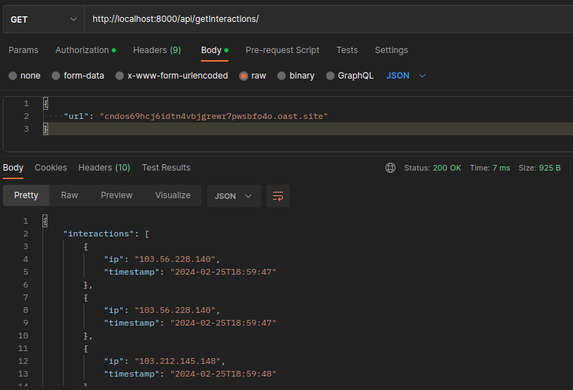

## Setup

1. Build the docker image

```sudo docker build -t interactshapi .```

2. Run the image

```sudo docker run interactshapi```

## Endpoints

1. GET /api/getURL: Gives a new test server URL

2. GET /api/getInteractions: Needs a `url` field in request body and gives out the interactions payload for the same


